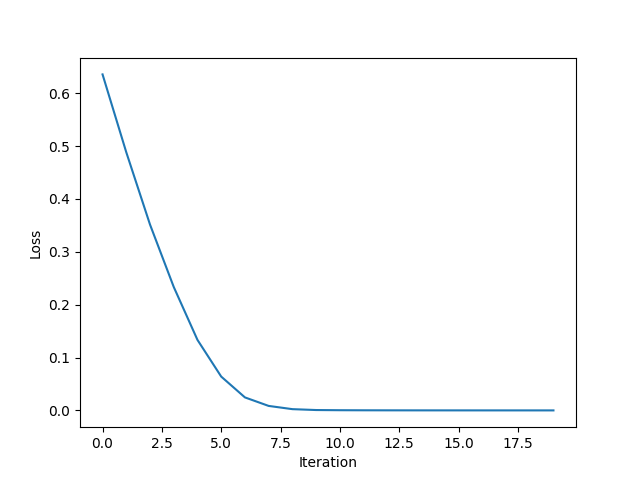
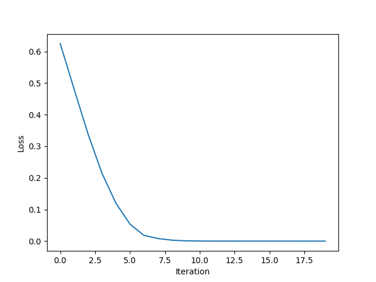
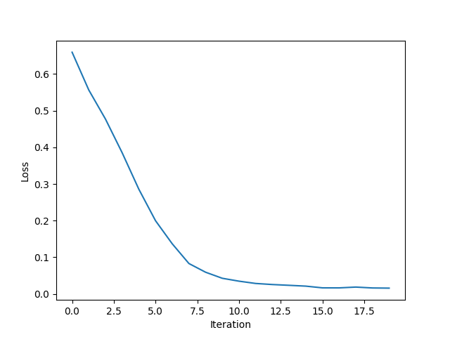

# TextCNN
The [TextCNN](https://arxiv.org/abs/1408.5882) project is a simple implementation of a convolutional neural network for text classification. The convolutional neural network is trained on the [IMDB dataset](https://ai.stanford.edu/~amaas/data/sentiment/), which is a dataset of 50,000 movie reviews labeled as positive or negative. The convolutional neural network is implemented in Python using the PyTorch library.

## Requirements
```shell
conda create -n pytorch python=3.9.18
conda activate pytorch

# install pytorch, the version is for CUDA 12.1
# from https://pytorch.org/get-started/locally/
pip3 install torch torchvision torchaudio --index-url https://download.pytorch.org/whl/cu121
pip3 install -r requirements.txt
```

## Usage
```shell
python3 main.py
```

The `config.json` file contains the configuration for the convolutional neural network.
- `model`: `conv1d`, `conv2d` or `textcnn`. If `conv1d`, a 1D convolutional neural network will be used. If `conv2d`, a 2D convolutional neural network will be used. If `textcnn`, a TextCNN model will be used.
- `data_dir`: the location of the IMDB dataset. **If the dataset is not found, it will be downloaded to this location**.
- `embedding_dim`: the dimension of the word embeddings.
- `batch_size`: the batch size to use for training.
- `learning_rate`: the learning rate to use for training.
- `num_epochs`: the number of epochs to train the convolutional neural network for.

## Results
The convolutional neural network is trained on the IMDB dataset for 20 epochs with a batch size of 32 and a learning rate of 0.001. 

The 1D convolutional neural network achieves an accuracy of **75.85%** on the test set. 

The 2D convolutional neural network achieves an accuracy of **76.47%** on the test set. 

The TextCNN model achieves an accuracy of **73.29%** on the test set. 